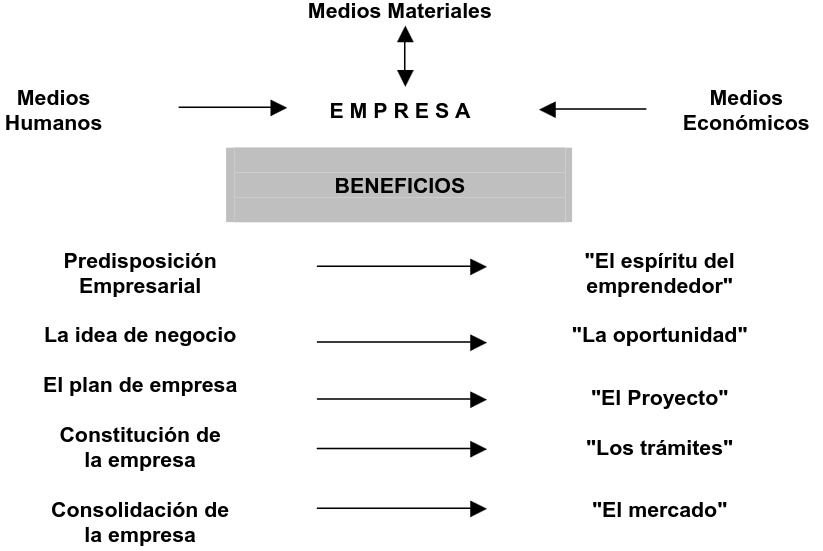
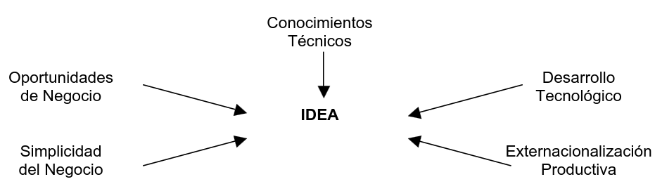
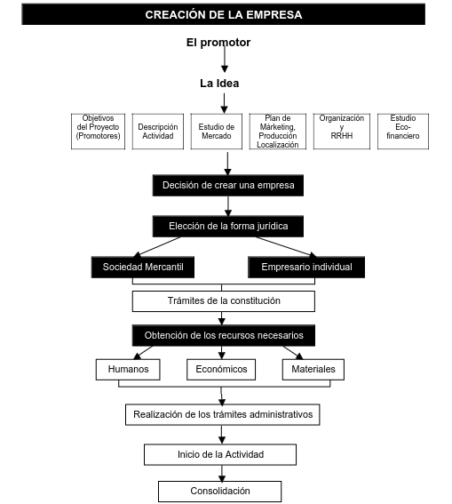
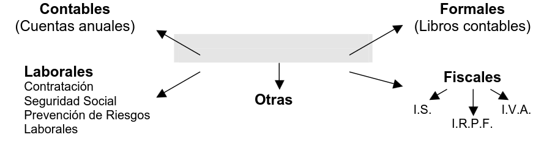

# **El proyecto de crear la empresa**

### Universidad Autonoma de Chihuahua - Facultad de Ingenieria

###### Gestoria Empresarial - 9HW1

###### Jesus Alejandro Jimenez Hernandez - 338906

---

# Crear la empresa

La creación de una empresa supone estructurar medios humanos, materiales y económicos con una finalidad: La obtención de beneficios.

**Las fases de este proceso son:**

1. La generación de la idea
2. La definición del proyecto empresarial
3. La puesta en marcha
4. Consolidación de la actividad de la empresa.

---

# Crear la empresa

---

# Antes de empezar

Crear una empresa supone:

- Invertir medios económicos
- Comprar materiales
- Utilizar recursos humanos, emplear nuevas personas o autoemplearlos.
- Coordinar a la vez todos esos recursos de manera que se destinen a cumplir los objetivos previamente establecidos.

---

# Antes de empezar

La duracion de la creacion de la empresa se da en función
de:

1. Grado de maduración de la idea
2. Nivel tecnológico
3. Necesidades de financiación
4. Especialización de las inversiones requeridas
5. Complejidad y distancia de los mercados objetivo

---

# Antes de empezar

**Psicológicas**

> Confianza en sí mismo
> Valor suficiente para asumir riesgos
> Serenidad
> Ambición e ilusión por el proyecto
> Creatividad y espíritu innovador

---

# Antes de empezar

**Intelectivas**

> Capacidad de organización
> Capacidad de coordinación
> Capacidad de dirección de equipos
> Capacidad de motivar
> Capacidad de tomar decisiones
> Capacidad de análisis de la realidad que le rodea y sus necesidades
> Capacidad de innovación y renovación constante
> Saber elegir a sus colaboradores

---

# Antes de empezar

**Formación**

> Conocimientos técnicos
> Conocimientos gerenciales
> Conocimiento del sector
> Experiencia laboral previa

---

# Idea para un negocio

---

# Creacion de la empresa

El proyecto de creación de la empresa finaliza con la elaboración del Plan de Empresa. A partir de ese momento, y en función de los resultados del mismo, los promotores deben de tomar una decisión. Si el Plan demuestra que el proyecto es viable y los promotores están convencidos de que pueden llevarlo a cabo, el camino de creación de la empresa se habrá iniciado.

---

# Creacion de la empresa

---

# Obligaciones del empresario

La realización de una actividad económica da lugar al cumplimiento de unos trámites administrativosconcretos, a través de los cuales surgen unas obligaciones a las que el empresario tiene que hacer frente.Estas obligaciones debe conocerlas con anterioridad y así establecer los mecanismos necesarios paraafrontarlas, llevar una contabilidad de acuerdo con lo establecido en el Código de Comercio, presentar lascorrespondientes declaraciones de impuestos, conocer los requisitos de la contratación de personal,establecer planes de prevención de riesgos laborales, constituyen unas obligaciones para la empresa quese pone en funcionamiento y ha de tenerlas en cuenta antes de que se inicie su actividad.

---

# Obligaciones del empresario

