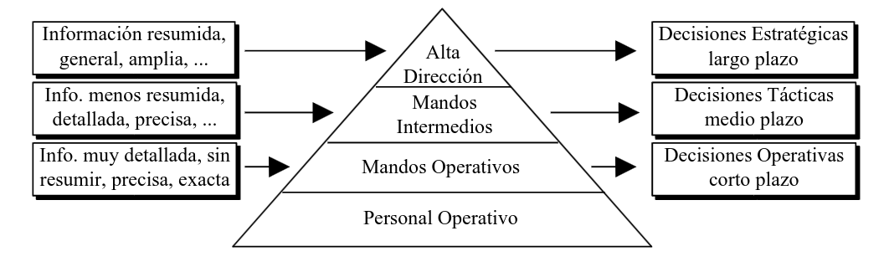

# **La empresa y los sistemas de informacion**

### Universidad Autonoma de Chihuahua - Facultad de Ingenieria

###### Sistemas de Informacion Gerencial - 9HW5

###### Jesus Alejandro Jimenez Hernandez - 338906

---

# Sistemas de Información

Conjunto formal de procesos que, operando sobre una colección de datos estructurada según las necesidades de la empresa, recopilan, elaboran y distribuyen la información (o parte de ella) necesaria para la operación de dicha empresa y para las actividades de dirección y control correspondientes, apoyando al menos en parte, la toma de decisiones necesaria para desempeñar las funciones y procesos de negocio de la empresa de acuerdo con su estrategia.

---

# Objetivos y Funciones

Facilitar las actividades administrativas y de gestión a todos los niveles, mediante el suministro de información adecuada y de calidad, a la persona que la necesite para su uso correcto
**Por parte de las funciones tenemos:**

- Capturar y recolectar datos relevantes.
- Almacenar datos para su posterior uso.
- Procesar datos para convertirlos en información útil.
- Distribuir y comunicar la información a quienes la necesiten.

---

# Pirámide de Jerarquía Organizacional

---

# Tipos de Sistemas de Información

## Sistemas de Información transaccionales

Buscan hacer un seguimiento de las actividades y las transacciones elementales de la organización.

- Capturan, procesan y almacenan datos de transacciones.
- La información presenta un alto grado de detalle.
- Ofrecen apoyo a las actividades operativas de la empresa.
- En la actualidad están muy consolidados los paquetes integrados de gestión.

---

# Tipos de Sistemas de Información

## Sistemas de información para la toma de decisiones

Son los sistemas en los que se apoya el seguimiento, control y toma de decisiones de los gerentes.

- Trabajan con información tanto interna (del SI Operacional) como externa.
- Incorporan herramientas de análisis de los datos para servir de apoyo a la toma de decisiones.

---

# Tipos de Sistemas de Información

## Sistemas de Información de Comunicación

El objetivo es poner en contacto a los personas de la organización.

- Está presente en todos los niveles.
- Maneja información más o menos formal y poco estructurada.
- Deben tener una funcionalidad muy variada para manejar diversos tipos de información.

---

# Stock

El stock o inventario son aquellos recursos acumulados o almacenados en espera de un uso posterior o
demanda (tanto interna como externa).

---

# Gestion de Stock

La gestión de almacén se ocupa fundamentalmente de:

- Ubicar los artículos recibidos en una ubicación correctamente identificada.
- Recuperar de la ubicación y enviarlos para lograr el nivel de servicio deseado.

---

# Gestion de Inventario

Por su parte la gestión del inventario o control del stock se encarga de:

- Registrar todos los movimientos, entradas y salidas.
- Informar permanentemente del estado del stock.
- Vigilar permanentemente el nivel de los stock y compararlo con los pedidos y ordenes defabricación.
- Comprobar la procedencia de los pedidos.
- Reservar los artículos asignados a un pedido.
- Administrar las entregas de los pedidos.
- Administrar el suministro de mercancías

---

# Gestión de la Producción

## Producción

Se ocupa de la actividad de producción de artículos, es decir, de su diseño, su implantación, su operación (fabricación) y del control del personal, los materiales, los equipos, el capital y la información para conseguir los productos.

## Producto

Es el nombre genérico que se da al resultado de un sistema productivo y que puede ser un bien o un servicio (un servicio es una actividad solicitada por una persona o cliente).

---

# Procesos de Gestión Comercial

El proceso de conseguir los recursos necesarios (humanos, financieros y materiales) para producir bienes y servicios de forma eficaz y eficiente. El proceso mediante el que se ejercen las funciones de planificar, organizar, dirigir y controlar.

## Niveles de gestion

- Gestion operativa
- Gestion tactica
- Gestion estrategica

---

# Contabilidad y Finanzas

El departamento financiero se ocupará de estudiar las fuentes de financiación más adecuadas y encontrarlas y ponerlas a disposición de la empresa. Además colocará los excedentes de recursos en los mercados financieros a través de la denominada gestión de tesorería. Conjuntamente con el área productiva habrá ordenado sus preferencias en los campos de materias primas, y de acuerdo con el área comercial habrá diseñado las políticas de ventas y cobros.

---

# Recursos Humanos y Nóminas

- Asesorar a los ejecutivos en la elaboración y administración del sistema de administración del personal.
- Proponer los proyectos y actividades necesarias para regular las relaciones de trabajo en la institución.
- Administrar los sistemas de clasificación de puestos y remuneración. Valorar y controlaraspectos como: eficiencia productiva, control de presencia y ausentismo, accidentes, etc.
- Administración del personal.
- Disciplina, quejas y agravios.
- Supervisar los pactos, convenios colectivos y las relaciones de trabajo.
